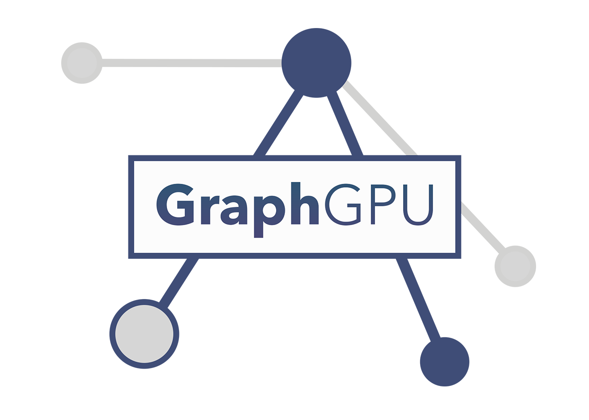

<div align="center">



<p align="center">
     <i>A WebGPU-accelerated, force-directed<br>graph visualization library for the browser</i> 
     <br><br>
     
     
     
</p>
</div>

---

<!--ts-->

- [What does this do?](#what-does-this-do)
- [How do I use it?](#how-do-i-use-it)
- [Features](#features)
- [API Reference](#api-reference)
- [Physics Engine](#physics-engine)
- [Demo](#demo)
- [Architecture](#architecture)
- [Contributing](#contributing)
- [License](#license)

<!--te-->

---

### What does this do?

**GraphGPU** is a hardware-accelerated graph visualization library. Rendering is powered entirely by WebGPU — nodes, edges, selection halos, and labels all go through GPU pipelines. The physics simulation (force-directed layout) runs on either CPU or GPU compute shaders, with a  model featuring gravitational repulsion, Hooke's law springs, central gravity, and proper velocity integration.

> [!NOTE]
> WebGPU is supported in Chrome 113+, Edge 113+, and Firefox Nightly. Safari has experimental support behind a flag. GraphGPU shows a fallback message on unsupported browsers.

### How do I use it?

```typescript
import { GraphGPU } from 'graphgpu';

const g = new GraphGPU({
    canvas: '#my-canvas',
    nodeSize: 8,
    edgeOpacity: 0.8,
    palette: 'vibrant',
});

await g.init();

const alice = g.put('person', { name: 'Alice', role: 'engineer' });
const bob   = g.put('person', { name: 'Bob', role: 'designer' });
const proj  = g.put('project', { name: 'GraphGPU' });

g.link(alice, 'worksOn', proj);
g.link(bob, 'worksOn', proj);
g.link(alice, 'knows', bob);

g.startLayout();
setTimeout(() => g.fitView(), 2000);
```

> [!TIP]
> Don't want to use a bundler? Grab `graphgpu.standalone.js` or `graphgpu.standalone.min.js` straight from the [latest release](https://github.com/drkameleon/GraphGPU/releases/latest) and drop it into a script tag:
> ```html
> <script src="graphgpu.standalone.min.js"></script>
> <script>
>     const g = new GraphGPU.GraphGPU({ canvas: '#my-canvas' });
> </script>
> ```

### Features

- **WebGPU-native rendering** — instanced draw calls, MSAA, SDF circles for nodes, anti-aliased edge quads
- **Physics** — gravitational repulsion, Hooke spring edges, central gravity, viscous damping
- **Dual layout engines** — CPU force layout for small/medium graphs, GPU compute shaders for large graphs
- **Animated mode** — live physics simulation with interactive drag (pinned nodes, elastic rebalancing)
- **8 built-in palettes** — `default`, `vibrant`, `pastel`, `earthy`, `inferno`, `playful`, `viridis`, `rainbow`
- **Full interactivity** — pan, zoom, drag, select, multi-select, hover
- **Canvas2D label overlay** — auto-sizing, truncation, contrast-adaptive text color
- **Contrast-adaptive selection halos** — lighter ring on dark backgrounds, darker on light, always the node's own color
- **Tag-based coloring** — nodes and edges auto-color by tag, palette-switchable at runtime
- **SoA data layout** — Structure-of-Arrays for cache-friendly access on large graphs

### API Reference

#### Constructor

```typescript
new GraphGPU({
    canvas: string | HTMLCanvasElement,
    nodeSize?: number,          // default: 6
    edgeOpacity?: number,       // default: 0.12
    palette?: string | Palette, // default: 'default'
    background?: [r,g,b,a],    // default: [0.03, 0.03, 0.05, 1]
    antialias?: boolean,        // default: true
    pixelRatio?: number,        // default: devicePixelRatio
    maxNodes?: number,          // default: 10000
    maxEdges?: number,          // default: 50000
})
```

#### Graph operations

| Method | Description |
|--------|-------------|
| `put(tag, properties?)` | Add a node with a tag and optional properties |
| `link(source, tag, target)` | Add an edge (supports arrays for batch linking) |
| `unput(nodeId)` | Remove a node and its connected edges |
| `unlink(edgeId)` | Remove an edge |

#### Layout

| Method | Description |
|--------|-------------|
| `startLayout(opts?)` | Start CPU force-directed layout |
| `stopLayout()` | Stop the running layout |
| `stepLayout(n?)` | Run N layout steps synchronously (useful for pre-stabilization) |
| `startGPULayout(opts?)` | Start GPU compute layout (falls back to CPU if unavailable) |
| `stopGPULayout()` | Stop and destroy GPU layout resources |
| `setAnimated(bool)` | Enable live physics mode (layout never auto-stops) |
| `pinNode(nodeId)` | Pin a node (excluded from physics, position set manually) |
| `unpinNode(nodeId)` | Unpin a node (rejoin physics simulation) |
| `fitView(padding?)` | Fit camera to show all nodes |
| `resetPositions()` | Randomize all node positions |
| `resize()` | Handle container/window resize |

#### Appearance

| Method | Description |
|--------|-------------|
| `setPalette(name)` | Switch color palette (recolors nodes AND edges) |
| `setBackground(rgba)` | Change background color |
| `getTagColors()` | Get current tag→color assignments |

#### Interaction

| Method | Description |
|--------|-------------|
| `setSelectionEnabled(bool)` | Toggle node selection |
| `setMultiSelectEnabled(bool)` | Toggle always-on multi-select |
| `on(event, handler)` | Listen for events |
| `off(event, handler)` | Remove listener |

#### Events

`node:click` · `node:select` · `node:deselect` · `node:hover` · `node:hoverout` · `node:drag` · `node:dragstart` · `node:dragend` · `node:dblclick` · `canvas:click` · `canvas:pan` · `canvas:zoom`

### Physics Engine

The layout simulation is modeled after [vis.js network](https://visjs.github.io/vis-network/docs/network/physics.html), with three force solvers running each tick:

| Force | Formula | Description |
|-------|---------|-------------|
| **Repulsion** | `F = G / dist²` | Gravitational N-body repulsion between all node pairs |
| **Springs** | `F = k × (L - dist) / dist` | Hooke's law along edges with rest length L |
| **Central gravity** | `F = g / dist` | Pull toward origin to prevent drift |

Velocity integration uses viscous damping: `a = (F - damping × v) / mass`, then `v += a × dt`, `pos += v × dt`.

```typescript
// All physics parameters are tunable:
g.startLayout({
    gravitationalConstant: -0.25,  // negative = repulsive
    springLength: 0.2,             // edge rest length
    springConstant: 0.06,          // spring stiffness
    centralGravity: 0.012,         // pull toward center
    damping: 0.18,                 // velocity friction
    timestep: 0.35,                // integration step
    maxVelocity: 0.06,             // velocity clamp
});
```

> [!TIP]
> **Animated mode** gives you vis.js-style interactive physics. When enabled, the layout runs continuously and dragging a node pins it while the rest of the graph reacts elastically:
> ```typescript
> g.setAnimated(true);
> // Now drag any node — connected nodes will follow with spring physics!
> ```

> [!WARNING]
> The CPU layout uses O(n²) brute-force repulsion. For graphs with 500+ nodes, use `startGPULayout()` which runs the same physics model on GPU compute shaders with O(n²/64) parallelism.

### Demo

The `demo/` folder contains a **cinema graph** (50+ nodes, 80+ edges) built with Vue 3 + TypeScript + SCSS:

```bash
cd demo
npm install
npm run dev
```

Features light/dark theme toggle, palette switching, node editing/deletion, animated physics mode, and a status bar with live node properties.

### Architecture

```
src/
    index.ts              # Public API (GraphGPU class)
    core/
        Graph.ts          # SoA graph data structure
        Camera.ts         # 2D camera with pan/zoom/fit
        Renderer.ts       # WebGPU render pipeline + Canvas2D labels
    shaders/
        index.ts          # WGSL vertex/fragment/compute shaders
    interaction/
        Controls.ts       # Mouse/touch/pinch input handling
    layout/
        ForceLayout.ts    # CPU force-directed layout (vis.js model)
        GPUForceLayout.ts # GPU compute force layout (5-pass pipeline)
    utils/
        color.ts          # Color parsing (hex, rgb, hsl)
        palette.ts        # 8 built-in color palettes
    types/
        index.ts          # TypeScript type definitions
```

### Contributing

You are 100% welcome! Just make a PR. 🚀

<hr/>

### License

MIT License

Copyright (c) 2026 Yanis Zafirópulos

Permission is hereby granted, free of charge, to any person obtaining a copy
of this software and associated documentation files (the "Software"), to deal
in the Software without restriction, including without limitation the rights
to use, copy, modify, merge, publish, distribute, sublicense, and/or sell
copies of the Software, and to permit persons to whom the Software is
furnished to do so, subject to the following conditions:

The above copyright notice and this permission notice shall be included in all
copies or substantial portions of the Software.

THE SOFTWARE IS PROVIDED "AS IS", WITHOUT WARRANTY OF ANY KIND, EXPRESS OR
IMPLIED, INCLUDING BUT NOT LIMITED TO THE WARRANTIES OF MERCHANTABILITY,
FITNESS FOR A PARTICULAR PURPOSE AND NONINFRINGEMENT. IN NO EVENT SHALL THE
AUTHORS OR COPYRIGHT HOLDERS BE LIABLE FOR ANY CLAIM, DAMAGES OR OTHER
LIABILITY, WHETHER IN AN ACTION OF CONTRACT, TORT OR OTHERWISE, ARISING FROM,
OUT OF OR IN CONNECTION WITH THE SOFTWARE OR THE USE OR OTHER DEALINGS IN THE
SOFTWARE.